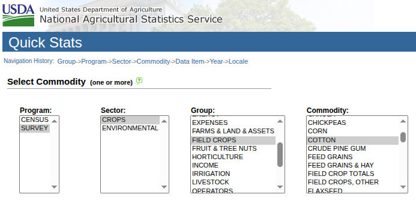
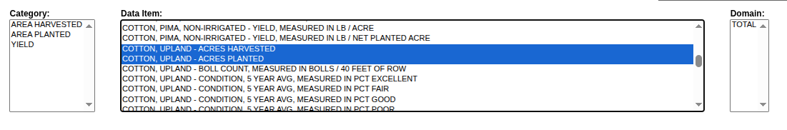
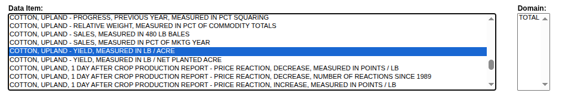
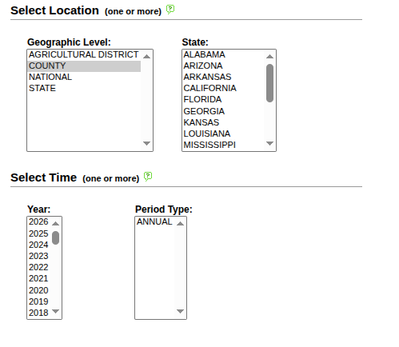

# Cotton Risk Management

Static interactive dashboard for subnational cotton production, historical cotton-climate anomalies, short-range weather anomalies, seasonal forecasts, and physical climate risks.

The application uses two harmonized agricultural variables:

- `planted_area_ha` — planted/sown/cultivated cotton area, hectares.
- `yield_t_ha` — cotton yield, tonnes per hectare.

Yield is the default map layer. A geographic unit is included in the packaged map/data only when at least one available year contains **both** a positive planted-area value and a positive yield value. Administrative areas that never satisfy that rule have been removed from the map geometry and supporting data.

## Run locally

The app uses `fetch()` to read local JSON, so do not open `index.html` with a `file://` URL.

- Windows: double-click `START_WINDOWS.bat`.
- macOS/Linux: run `sh START_MAC_LINUX.sh`.
- Or run `python3 -m http.server 8000` from this folder.

Then open `http://localhost:8000`.

## Geographic coverage

- United States: counties, 2010–2025.
- India: districts, 2010–2019.
- Brazil: municipalities, 2010–2024.
- Mexico: municipalities, 2010–2025.
- Pakistan: provinces, crop years beginning 2010–2025; 2019 is unavailable in the source series.
- Argentina: departments/partidos, harvest years 2010–2025.
- Turkey: provinces, 2024.
- China: provinces, 2024–2025.
- Uzbekistan: regions, 2010–2024.
- Australia: states, 2024–2025.
- Spain: provinces, 2014–2024.

The packaged U.S. climate-anomaly grid is additionally restricted to climate grid points used by at least one retained cotton-producing U.S. county.

## Data files

- `data/cotton_YYYY.json` — retained U.S. county records.
- `data/cotton_india_YYYY.json` — retained India district records.
- `data/cotton_international_YYYY.json` — retained non-U.S./non-India records.
- `data/us-counties.topo.json` — boundaries only for retained U.S. cotton counties.
- `data/india-districts.geo.json` — boundaries only for retained India cotton districts.
- `data/international-cotton-regions.geo.json` — boundaries only for retained international cotton areas.
- `data/cotton_context.json` — U.S. cotton growing-season calendars and the small validated pest-information set used by the expandable profile.
- `data/us-county-cities.json` — municipal reference points used by the weather/forecast APIs for retained U.S. cotton counties.
- `data/climate/manifest.json` — climate schema, metric definitions, stages, H3 resolution and legacy-grid-to-H3 lookup.
- `data/climate/grids/<H3>.json` — one compact historical climate record per retained H3 resolution-6 location.

## Climate grid JSON schema

### Spatial key

Every climate file is named with an actual Uber H3 cell ID at **resolution 6**, for example:

```text
8648b3da7ffffff.json
```

The same value appears as `grid_id` inside the file. The climate observations were originally calculated at the underlying 0.5° climate-grid point. H3 is used here as the stable spatial identifier for the cell containing that source grid point; changing the identifier does **not** imply that the source climate field was resampled to native H3 resolution.

The dashboard still selects the nearest 0.5° source point from the county reference location. `manifest.json > grid_lookup` translates that legacy lookup key to its H3 resolution-6 file ID.

### Dictionary-style record

Values are stored by explicit metric name rather than positional arrays. A simplified record is:

```json
{
  "grid_id": "8648b3da7ffffff",
  "years": [2010, 2011, 2012, 2013, 2014, 2015, 2016, 2017, 2018, 2019, 2020, 2021, 2022, 2023, 2024, 2025],
  "growth_periods": {
    "flowering_boll_set": {
      "climatology": {
        "dry_days": 12.4,
        "cotton_gdd_base_15_6c": 802.1
      },
      "standard_deviation": {
        "dry_days": 4.2,
        "cotton_gdd_base_15_6c": 63.7
      },
      "anomaly_by_year": {
        "2025": {
          "dry_days": 6.6,
          "cotton_gdd_base_15_6c": 41.3
        }
      }
    }
  }
}
```

Only fields used by the current app are retained. Raw annual climate values, relative-anomaly arrays, empty future-projection arrays, unused coordinates, and the removed `persistent_low_sun_days` metric are not stored in these grid files.

## Cotton growth periods used by the climate heatmap

The climate data use fixed calendar windows so the same methodology can be compared across all U.S. grid points:

| ID | Display name | Calendar window |
|---|---|---|
| `preplant` | Pre-plant | 1 March–30 April |
| `establishment` | Establishment | 1–31 May |
| `vegetative_squaring` | Vegetative / squaring | 1–30 June |
| `flowering_boll_set` | Flowering / boll set | 1 July–31 August |
| `boll_filling_opening` | Boll filling / opening | 1–30 September |
| `harvest_postseason` | Harvest / post-season | 1 October–31 December |

The state-specific growing-season dates displayed next to Yield and Planted area are a separate agronomic context layer; they do not redefine these fixed heatmap calculation windows.

## Climate indicators and calculations

For each source grid point and each growth period, daily observations are converted into the following period indicators. Day counts are the number of days satisfying the stated threshold.

| JSON key | Indicator | Unit | Daily calculation |
|---|---|---:|---|
| `frost_days` | Frost days | days | Count days with `Tmin < 0°C`. |
| `dry_days` | Dry days | days | Count days with precipitation `< 1 mm/day`. |
| `rainy_days` | Rainy days | days | Count days with precipitation `>= 1 mm/day`. |
| `heavy_rain_days` | Heavy-rain days | days | Count days with precipitation `>= 10 mm/day`. |
| `extremely_hot_days` | Extremely hot days | days | Count days with `Tmax > 40°C`. |
| `hot_nights` | Hot nights | days | Count days with `Tmin > 25°C`. |
| `insufficient_heat_days` | Insufficient-heat days | days | Count days with `Tmean < 15.6°C`. |
| `windy_days_20mph` | Windy days >=20 mph | days | Count days with daily maximum 10 m wind `>= 20 mph` (`8.9408 m/s`). |
| `damaging_wind_days_30mph` | Damaging-wind days >=30 mph | days | Count days with daily maximum 10 m wind `>= 30 mph` (`13.4112 m/s`). |
| `high_humidity_days` | High-humidity days | days | Count days with daily mean relative humidity `>= 80%`. |
| `insufficient_sunlight_days` | Insufficient-sunlight days | days | Count days where incoming all-sky solar radiation is below 60% of the clear-sky/reference radiation used by the calculation. |
| `cotton_gdd_base_15_6c` | Cotton GDD, base 15.6°C | °C-days | For every day calculate `max(Tmean - 15.6°C, 0)`, then **sum those positive heat units** across the selected period. A daily value below the base temperature contributes zero; GDD itself is therefore not a count of days. |

`Persistent low-sun days` has been removed from both the application and the packaged climate JSON.

### Historical climatology

The reference period is **1991–2025**. For indicator `m`, growth period `p`, and reference years `y = 1991...2025`:

```text
climatology(m,p) = mean[ value(m,p,y) ]
```

The stored `standard_deviation` is the interannual variability of that same period indicator over the reference years. The application treats one standard deviation (`1σ`) as the threshold for highlighting an anomaly.

### Annual historical anomaly

For a displayed year `y`:

```text
anomaly(m,p,y) = value(m,p,y) - climatology(m,p)
```

A positive anomaly means the indicator occurred more often / accumulated more strongly than its 1991–2025 reference; a negative anomaly means less.

The heatmap highlights only:

```text
Above normal: anomaly > +1σ
Below normal: anomaly < -1σ
```

Cells within `±1σ` are deliberately left blank.

### Product rule for one-sided adverse indicators

For the following six indicators the current product displays only positive adverse anomalies, so negative anomaly values are intentionally stored as `null` rather than retained as unused numbers:

- `frost_days`
- `dry_days`
- `heavy_rain_days`
- `extremely_hot_days`
- `windy_days_20mph`
- `damaging_wind_days_30mph`

This is a display/data-minimization rule, not a claim that the physical negative anomaly is mathematically zero.

### Overall growing-season row

When the user selects **Overall growing season**, the app sums the available stage anomalies for each metric. Stage standard deviations are combined by root-sum-square:

```text
overall anomaly = sum(stage anomalies)
overall σ = sqrt(sum(stage σ²))
```

The second formula is the operational aggregation used by the app; it treats stage variability as independent for this threshold calculation.

## 2030 and 2035 climate columns

Future climate values are not stored as unused arrays in the local grid JSON. When needed, the app requests daily CMIP6 climate data through the Open-Meteo Climate API using the county reference location and the `MRI_AGCM3_2_S` model.

- **2030** represents the five-year window 2028–2032.
- **2035** represents the five-year window 2033–2037.

For each year and growth period, the same climate-indicator thresholds above are calculated. The app then averages the five annual indicator totals in the target window and subtracts the historical period climatology:

```text
projection anomaly = mean(projected annual indicator over 5-year window)
                     - 1991–2025 climatology
```

The same `±1σ` historical threshold determines whether the future cell is highlighted.

For projected insufficient sunlight, the app estimates a monthly high-radiation reference from the climate-model daily radiation series (95th percentile) and counts a day as insufficient sunlight when daily shortwave radiation / that monthly reference is below `0.60`.

## Weather Forecast tab heatmap methodology

The Weather Forecast tab requests the next **7 days** from the Open-Meteo Forecast API for the selected county reference point. It displays daily:

- minimum temperature,
- maximum temperature,
- mean temperature,
- precipitation,
- maximum 10 m wind,
- mean relative humidity,
- shortwave solar radiation.

The historical reference is calculated from **ERA5-Land via the Open-Meteo Archive API for 2000–2025** at the same location. Historical observations are grouped by calendar day (`MM-DD`). For each variable and calendar day the app calculates the historical mean and sample standard deviation:

```text
forecast anomaly = forecast daily value - 2000–2025 calendar-day mean
Above normal if forecast value > mean + 1σ
Below normal if forecast value < mean - 1σ
```

Values within `±1σ` are left blank. The tooltip shows the forecast value, historical daily average and `1σ`. This is an anomaly heatmap; threshold definitions in the indicator tooltips provide crop-relevance context but do not replace the `±1σ` color rule.

## Seasonal Forecast tab heatmap methodology

The Seasonal Forecast tab requests up to **180 forecast days** from the Open-Meteo Seasonal Forecast API and displays the first six forecast months.

For each forecast month:

- **Temperature** = mean of available daily `temperature_2m_mean` values. If an ensemble-member series is returned instead of the primary series, the app uses the mean across available temperature ensemble series for that day.
- **Precipitation** = sum of available daily `precipitation_sum` values.

The 2000–2025 ERA5-Land archive is grouped into calendar months. For each month number (January, February, etc.), the app calculates across historical years:

- mean monthly mean temperature and its sample standard deviation;
- mean monthly precipitation total and its sample standard deviation.

The seasonal cell classification is:

```text
Above normal: forecast monthly value > 2000–2025 monthly mean + 1σ
Below normal: forecast monthly value < 2000–2025 monthly mean - 1σ
```

Values within `±1σ` are left blank. Month headings use full four-digit years (for example `2026`, `2027`).

## Physical Climate Risks tab

The Climate Risks tab is separate from the cotton-indicator anomaly data. It requests physical hazard scores for the selected location from the Weather Trade Net hazards API and renders the returned historical/scenario risk ratings. These risk scores should not be interpreted as the indicator anomalies described above.

## Main data sources

- United States cotton: USDA NASS Quick Stats.
- India: Government of India OGD / UPAg district-wise crop statistics.
- Brazil: IBGE SIDRA Municipal Agricultural Production.
- Mexico: DGSIAP/SIAP annual agricultural statistics.
- Pakistan: SUPARCO Space4Climate historical cotton estimates.
- Argentina: Dirección de Estimaciones Agrícolas.
- Turkey: TURKSTAT.
- China: National Bureau of Statistics.
- Uzbekistan: SIAT.
- Australia: ABARES Australian Crop Report.
- Spain: MAPA Statistical Yearbooks / Junta de Andalucía.
- Historical cotton climate-anomaly files: NASA POWER-derived daily climate grid, 0.5° source resolution, historical reference 1991–2025.
- Weather/seasonal references: ERA5-Land through Open-Meteo Archive API, 2000–2025.
- Short-range forecast, seasonal forecast and future climate API delivery: Open-Meteo.
- H3 spatial indexing: Uber H3, resolution 6.

## USDA Quick Stats selection reference

1. Select `SURVEY`, `CROPS`, `FIELD CROPS`, and `COTTON`.
   
2. Select the upland cotton area data item.
   
3. Select `COTTON, UPLAND - YIELD, MEASURED IN LB / ACRE`.
   
4. Select county geography, years and annual period type.
   

## Recovered international boundaries

The international production table contains 24 retained records that were not represented by a geometry in the supplied atlas boundary file.

- Argentina `AR10000`, `AR18000`, `AR34000`: the agricultural source names the department as `sin definir` (undefined). The project therefore stores the corresponding Catamarca, Corrientes and Formosa **province** polygon locally, built as the union of the retained department polygons for that province. This avoids inventing a department boundary that the source does not identify.
- Mexico: 20 missing municipality records are resolved by their exact INEGI five-digit municipality code. `data/missing-boundary-sources.json` maps each cotton record to the corresponding INEGI-derived municipality GeoJSON.
- Brazil `BR5006275`: Paraíso das Águas is resolved by IBGE municipality code `5006275` through the IBGE territorial-mesh API.

The app loads the local international GeoJSON first and then adds these 21 code-matched municipality geometries. Because the base map itself is online, an internet connection is already required for the full map experience; these recovered municipality boundaries use the same online runtime model. No synthetic municipality contour is substituted.
